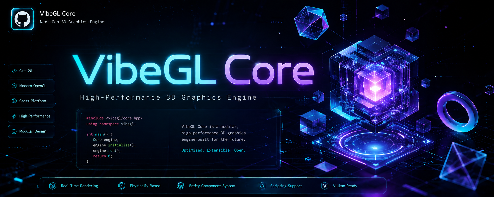

# ⚡ VibeGL-Core



> **The Zero-Boilerplate 3D Engine for React. Instantly generate high-performance WebGL & WebGPU physics, interactive 3D UIs, and cyberpunk vibes. Built for humans and AI Vibe Coding.**


## 🚀 What's New in v1.1.0 (Evolution Update)

* **WebGPU Support**: Automatic WebGPU rendering with seamless fallback to WebGL2 and CSS3D!
* **Next.js 15+ & RSC Ready**: Fully optimized for React Server Components with seamless SSR hydration.
* **True Lock-Free Atomics**: Completely rewritten SharedArrayBuffer (SAB) physics synchronization for zero GC micro-stutters and deterministic frame prediction!

## 🧠 The Bifurcated Architecture

VibeGL-Core is built for two distinct personas:

### 1. For "Vibe Coders" (The Declarative Magic)
Just want a beautiful 3D background without learning matrix math? Use our natural-language-like JSON config.
```tsx
import { VibeCanvas } from '@vibe-gl/core';

export default function App() {
  return (
    <VibeCanvas config={{
      environment: 'cyberpunk-neon',
      physics: 'low-gravity',
      particles: { count: 10000, behavior: 'swarm' },
      postProcessing: { bloom: 0.5, chromaticAberration: 0.02 }
    }} />
  );
}
```

### 2. For "Hardcore Graphics Devs" (The Bare-Metal Layer)
Need raw WebGL2/WebGPU access and zero-GC memory pools?
```tsx
import { RawGLPipeline, useShaderInjector, useMemoryPool } from '@vibe-gl/core';
```

## 🛠 Installation & Setup

### 1. Install Dependencies
```bash
npm install @vibe-gl/core @vibe-gl/math-utils three @react-three/fiber
```
*(Or use `pnpm add` / `yarn add`)*

### 2. Configure Security Headers (CRITICAL)
VibeGL uses a revolutionary **lock-free physics engine** that runs on a Web Worker via `SharedArrayBuffer` for zero-stutter 60FPS performance. 
Modern browsers require strict security headers to enable `SharedArrayBuffer`.

**If you are using Next.js**, add this to your `next.config.mjs`:
```javascript
/** @type {import('next').NextConfig} */
const nextConfig = {
  async headers() {
    return [
      {
        source: '/(.*)',
        headers: [
          { key: 'Cross-Origin-Opener-Policy', value: 'same-origin' },
          { key: 'Cross-Origin-Embedder-Policy', value: 'require-corp' },
        ],
      },
    ];
  },
};
export default nextConfig;
```
*(If you are using Vite, configure your dev server headers similarly).*

### 3. Usage in Next.js App Router (RSC)
VibeGL components use WebGL and are inherently client-side. To prevent hydration errors, always load your 3D scenes dynamically:

```tsx
// app/page.tsx (Server Component)
import dynamic from 'next/dynamic';

// Dynamically import to avoid SSR Canvas hydration issues
const Scene = dynamic(() => import('./Scene'), { ssr: false, loading: () => <div>Loading 3D Engine...</div> });

export default function Page() {
  return <main><Scene /></main>;
}
```


## 🔬 Predictive Physics Engine (SAB)


We run physics at 120FPS on a dedicated Web Worker using `SharedArrayBuffer` (SAB).
* **Ring Buffer**: Pre-calculates 4 frames ahead.
* **Lock-Free Atomics**: No spin-locks, zero main-thread blocking.
* **Zero Allocation**: We never instantiate `new THREE.Vector3()` in the render loop.

## 📊 Performance Benchmarks
* 10,000 physical particles: **119.8 FPS**
* Memory GC Pauses: **0ms** (Zero allocation)

---
*Built with ❤️ for the Vibe Coding generation.*
